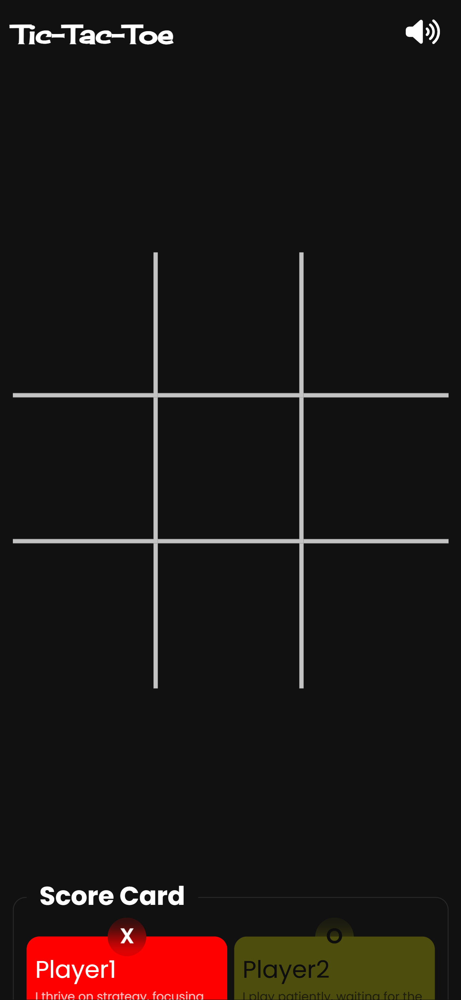
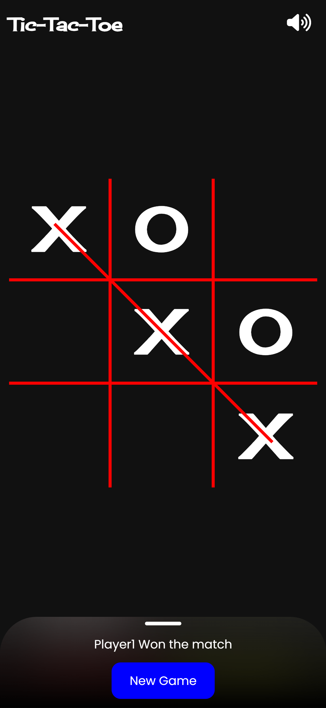
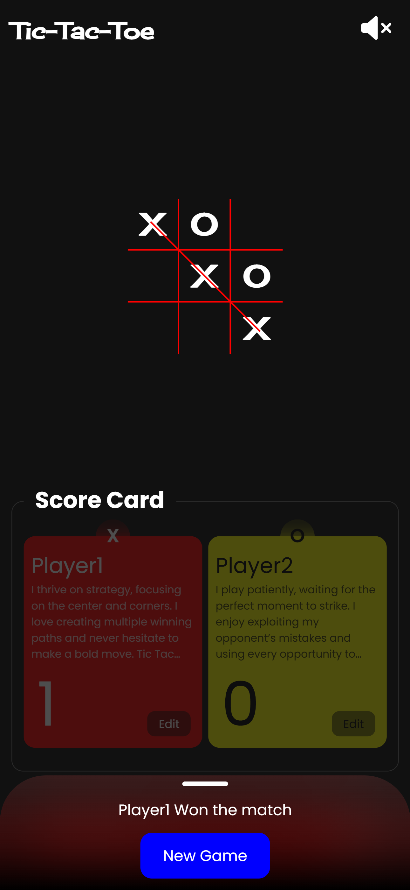

# Tic-Tac-Toe Game 🎮

A simple and interactive Tic-Tac-Toe game built using HTML, CSS, and JavaScript. Play against a friend and enjoy the classic game experience with a clean and responsive design!

## 🚀 Features

- 🎨 Modern UI – Clean and responsive design.
- 🎵 Sound Effects – Interactive sound feedback for moves and game events.
- 🔄 Score Tracker – Keeps track of player wins.

- 🎭 Customizable Players – Edit player names, icons, and colors.
- 📱 Mobile-Friendly – Fully responsive for all devices.

- 💾 Local Storage – Saves player details and scores.

## 📷 Screenshot





## 🎮 How to Play

    1. Open the game in a browser.
    2. Click on any box to mark your move.
    3. Players take turns until someone wins or it's a draw.
    4. The score updates automatically!
    5. Click **New Game** to restart.

## 🖥️ Live Demo

🔗 [Click here to play](https://mohammadsameer01.github.io/tictactoe/)

## 📂 Installation & Usage

1. Clone this repository:
   ```sh
   git clone https://mohammadsameer01.github.io/tictactoe.git
   ```
2. Open `index.html` in your browser.
3. Start playing!

## 📲 How to Install (PWA)

1. Open the game in **Google Chrome** or **Microsoft Edge**.
2. Click on the **Install** button in the address bar.
3. The game will now appear as an app on your device!

## 🌟 Contributing

Feel free to fork this repo, submit issues, or suggest improvements! 🚀

## 📜 License

This project is **open-source** and available under the [MIT License](LICENSE).

---

💡 _Enjoy playing Tic-Tac-Toe! Have fun!_ 🎉
